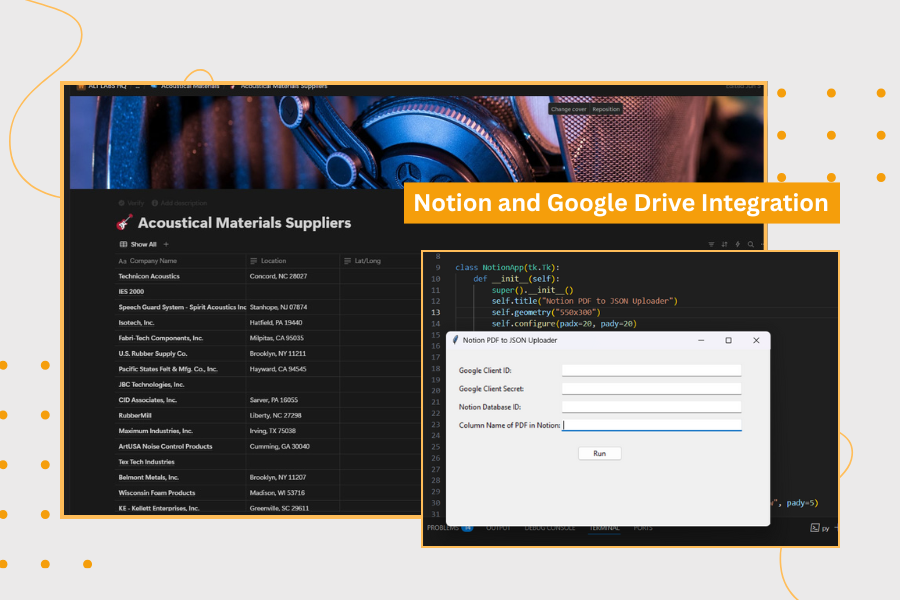

# 📄 Notion PDF to JSON Converter

## 📌 Overview

This project provides a script/tool to automate the extraction of data from PDF files exported from **Notion** and convert them into structured **JSON** format.

By transforming Notion PDF exports into machine-readable JSON, this tool enables easier integration, data analysis, and further processing of Notion content.


---

## ⚙️ Technologies Used

- **Python**
- **PDF Parsing Libraries** (e.g., PyPDF2)
- **JSON Processing**
- **Regular Expressions**
- **GUI using tkinter**
- **Google Drive API**
- **Notion API**

---

## 🚀 Features

- 📥 **Reads** and parses Notion-exported PDF files.
- 🔍 **Extracts** text, tables, and relevant content from PDFs.
- 🗂️ **Converts** extracted content into a clean, structured JSON format.
- 🛠️ **Handles** multi-page PDFs and complex Notion layouts.
- 🏷️ **Supports** customization for different Notion template styles.
- ⚡ **CLI utility** for easy automation and scripting.
- 🗂️ **Stores** generated output to Google Drive using Google Drive API.

---

## 📂 Folder Structure

```
notion-pdf-to-json/
│
├── main.py                # Main script/entry point
├── parser.py              # PDF parsing and extraction logic
├── .env                   # Environment variables, not committed
├── requirements.txt       # Python dependencies
└── README.md              # Project documentation
```

---

## 🔐 Environment Variables

Use a `.env` file to store credentials and keys:

```
NOTION_TOKEN=your_notion-token_here
```

Load them in your script with:

```python
from dotenv import load_dotenv
load_dotenv()
```

---

## ✅ Prerequisites

- Python 3.7+
- `notion-client`, `requests`, `PyMuPDF`, `google-auth-oauthlib`, `google-api-python-client`, `python-dotenv`

Install dependencies:

```bash
pip install -r requirements.txt
```

---

## 🏁 Getting Started

1. Clone the repo.
2. Add your `.env` file.
3. Run the script:

```bash
python main.py
```

---

## 📌 Notes

- Designed for PDFs exported from Notion; may require adjustments for other PDF formats.
- Always verify the JSON output for correctness, as PDF parsing may have edge cases.
- Contributions and feature requests are welcome!

---

## 📧 Contact

For issues or feature requests, please contact [Jhon Loyd Pastorin](mailto:jhonloydpastorin.03@gmail.com).
